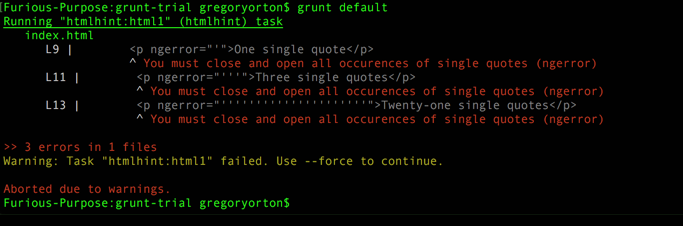

For Anja:

see ``index.html`` for test file with 'errors'.

uses grunt and HTML hint with custom rules to find ngerror="" attributes and flag then if they contain values with incorrect numbers of single quotes ``'``

was forced to use original ``htmlhint`` git repo, and then run its grunt task to use my rule. But it works. Check out this output:

?raw=true "Example of task being run on index.html")
